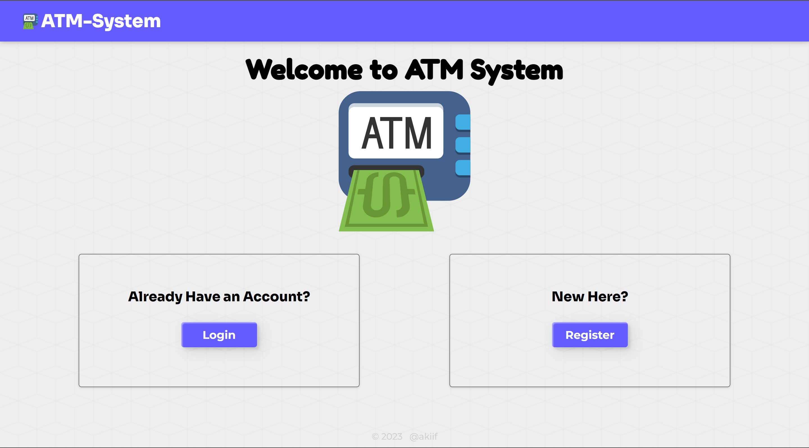
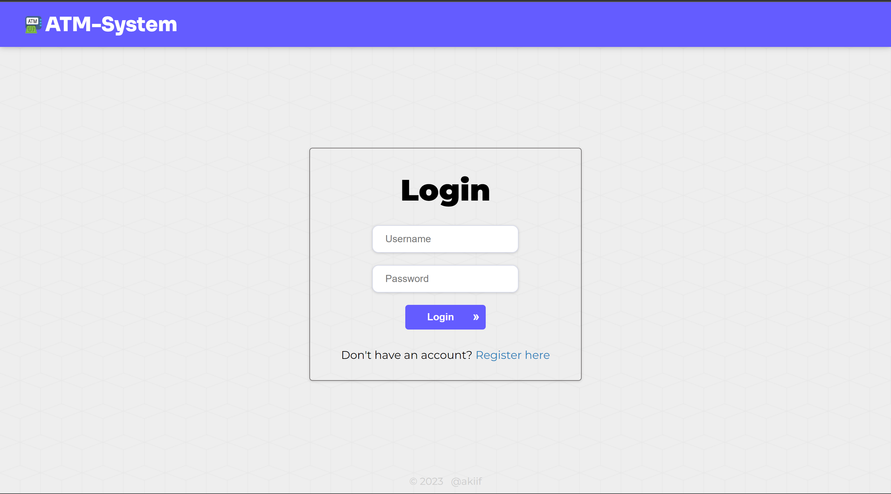
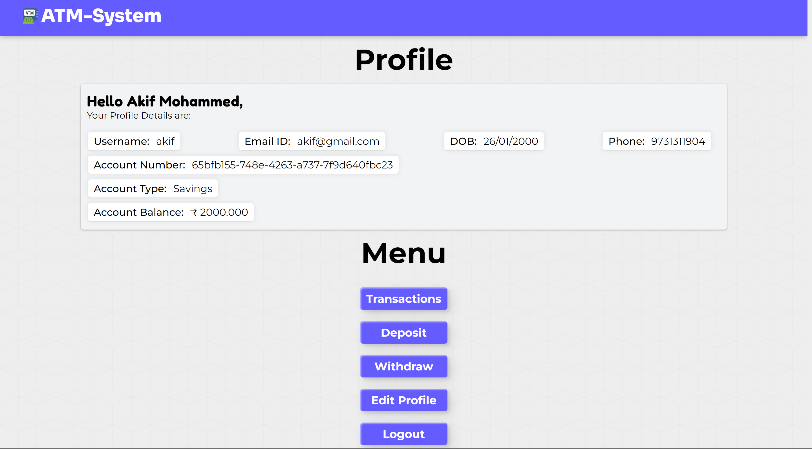
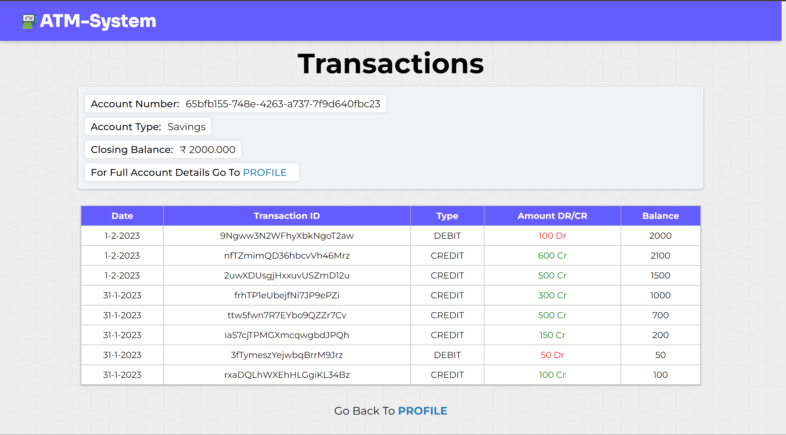
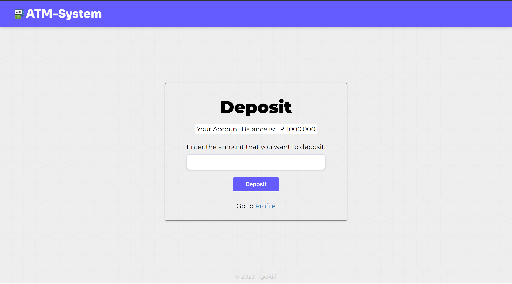
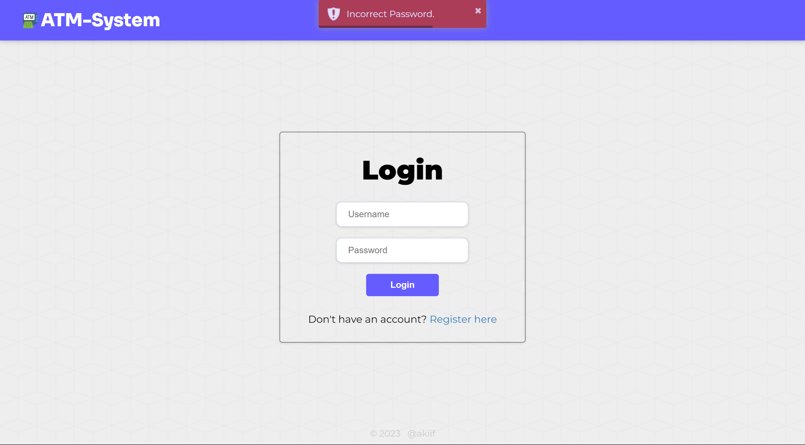

# atm-system

> An ATM System Management app built using Node.js and MySQL.
> The user can create a new bank account and login using local authentication.
> It features CRUD operations as well as use of SQL Triggers.
> The user can view all their transactions in the Transactions Page.
> View [Gallery](#gallery)

## Table of contents

-   [General info](#general-info)
-   [Technologies](#technologies)
-   [Gallery](#gallery)
-   [Features](#features)
-   [Setup](#setup)
-   [Contact](#contact)

## General info

An ATM System Management app built using Node.js and MySQL.
It features CRUD operations as well as use of SQL Triggers.
When a user registers their info is stored in the 'Accounts' Table.
Whenever a user deposits or withdraws any amount a sql trigger is triggered which updates the balance in the accounts table. The transactions is also stored in a separate Transactions table.

## Technologies

-   Node.js 18.2.1
-   MySQL 8.0.32
-   Express 4.18.2
-   Passport 0.6.0

## Gallery
- Home Page:


- Login Page:


- Profile Page:


- Transactions Page:


- Deposit Page:


- Toast:


## Features
- The atm_system database consists of 5 tables, i.e. 'Accounts', 'Account_Types', 'Sessions', 'Transaction' and 'Transaction_Types'.
-   The website consists of Eight pages, i.e Home, Login, Register, Profile, Edit Profile, Withdraw, Deposit and Transactions page.
-   The user created can login using local authentication if he has an account or else they create a can create a new account.
-   Once the user is logged they are redirected to the profiles page where the profile info is shown and a menu list is present from which they can redirect to Transactions, Deposit, Withdraw, Edit Profiles Page or logout Button.
-   The user can deposit and withdraw money using this app. 
-   Whenever a user deposits or withdraws any amount a sql trigger is triggered which updates the balance in the accounts table. The transactions is also stored in a separate Transactions table.
-   A 'Sessions' table is also present which is used to store the sessions which is implemented using the 'express-mysql-session' npm package.
-   The Toastr package is used to show toast notifications.

## Setup

To run this project:

-   Make sure you have [NodeJs](https://nodejs.org/en/), [yarn](https://yarnpkg.com/) and [MySQL](https://dev.mysql.com/downloads/mysql/) installed in your system.
-   First create a database called as atm_system in your MySQL server.
-   Then, open the src/config/dbOptions.config.json file and set the proper MySQL credentials according to your system.
-   Then, Install it locally using yarn:
```
$ cd atm-system
$ yarn
```
- Then run the src/db/db.init.js file to initialize the database using node:
```
$ node src/db/db.init.js
```
-   You need to create a .env file and add the following keys:
    - SESSION_KEY (any random string)
  
- Finally you can run the app using yarn:
```
$ yarn start   # or 'yarn dev' if you have nodemon.
```
- Now open the url [http://localhost:3150](http://localhost:3150) on your browser.

## Contact

Created by [@akiif](https://akiif.dev/) - feel free to contact me!